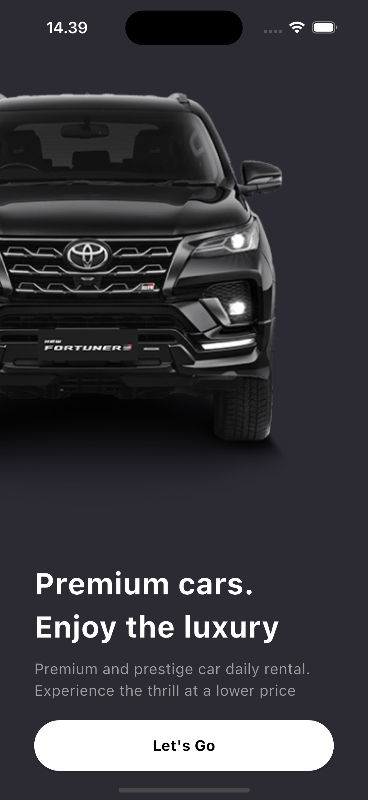
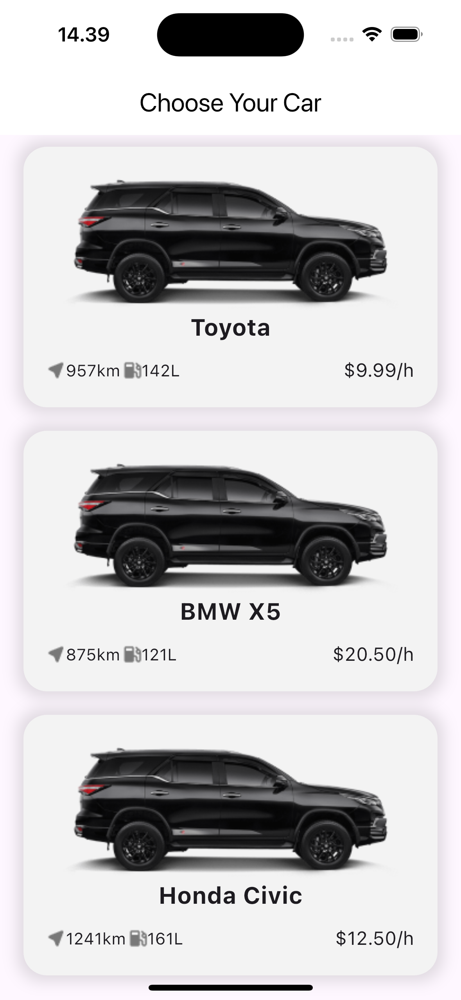
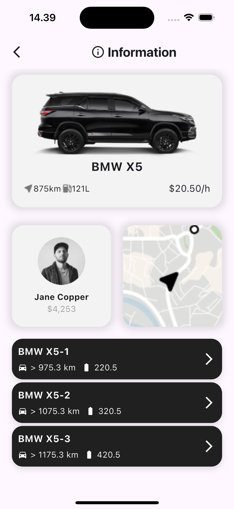
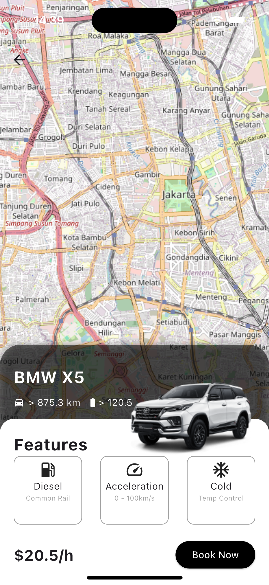

# Car Rental App 🚗

Aplikasi penyewaan mobil berbasis **Flutter** dengan integrasi **Firebase (Cloud Firestore)**, arsitektur **BLoC**, dan tampilan peta menggunakan **flutter_map (OpenStreetMap)**.

> Project ini menampilkan daftar mobil, detail mobil, halaman peta dengan overlay kartu detail, dan integrasi data dari Firestore.

---

## ✨ Fitur Utama
- **Daftar Mobil** (list & card view)
- **Detail Mobil** + informasi harga/jarak/kapasitas
- **Halaman Peta** menggunakan `flutter_map` (OSM)
- **Animasi UI** (transform/scale pada preview maps)
- **State Management** dengan **BLoC** (`flutter_bloc`)
- **Data Tersinkronisasi** via **Cloud Firestore**

---

## 🧱 Teknologi & Paket
- Flutter 3.x, Dart 3.x
- **State**: `flutter_bloc`
- **Firebase**: `firebase_core`, `cloud_firestore`
- **Maps**: `flutter_map`, `latlong2`
- **UI**: Material 3

Tambahkan pada `pubspec.yaml` (versi contoh, sesuaikan terbaru):
```yaml
dependencies:
  flutter:
    sdk: flutter
  firebase_core: ^4.0.0
  cloud_firestore: ^6.0.0
  flutter_map: ^8.2.1
  latlong2: ^0.9.1
  path_provider: ^2.1.5
  bloc: ^9.0.0
  flutter_bloc: ^9.1.1
  get_it: ^8.2.0
```

---

## 🚀 Memulai (Getting Started)
### 1) Prasyarat
- Flutter SDK terpasang (`flutter --version`)
- Android Studio/Xcode + emulator/device
- Akun & Project **Firebase**

### 2) Clone & Install
```bash
git clone https://github.com/wandi1209/car-rental-app.git
cd car-rental-app
flutter pub get
```

### 3) Setup Firebase (FlutterFire CLI)
```bash
dart pub global activate flutterfire_cli
firebase login
flutterfire configure # pilih project & platform
```
Ini akan membuat `lib/firebase_options.dart` dan mengonfigurasi Android/iOS.

#### Android
- Letakkan `android/app/google-services.json`
- Pastikan di `android/build.gradle` & `android/app/build.gradle` sudah ada plugin `com.google.gms.google-services`.

#### iOS
- Letakkan `ios/Runner/GoogleService-Info.plist`
- Jalankan `cd ios && pod install && cd ..`

### 4) Jalankan Aplikasi
```bash
flutter run
```

---

## 🗺️ Halaman Peta (flutter_map)
Contoh konfigurasi dasar:
```dart
Scaffold(
  extendBodyBehindAppBar: true,
  appBar: AppBar(backgroundColor: Colors.transparent, elevation: 0),
  body: Stack(children: [
    SizedBox.expand(
      child: FlutterMap(
        options: MapOptions(
          initialCenter: LatLng(-6.2, 106.816),
          initialZoom: 13,
        ),
        children: [
          TileLayer(
            urlTemplate: 'https://tile.openstreetmap.org/{z}/{x}/{y}.png',
            userAgentPackageName: 'com.wandidev.app',
          ),
        ],
      ),
    ),
    Align(alignment: Alignment.bottomCenter, child: CarDetailsCard(...)),
  ]),
);
```
> `extendBodyBehindAppBar: true` membuat konten body merentang ke belakang AppBar (cocok untuk header transparan di atas peta).

**Catatan OSM**: Server tile OSM publik tidak untuk beban produksi tinggi. Pertimbangkan penyedia tile berbayar/mandiri (MapTiler, Mapbox, dsb.) untuk production.

---

## 🧩 Animasi pada Preview Maps
Animasi **zoom-in** sederhana menggunakan `AnimationController` + `Transform.scale`:
```dart
_controller = AnimationController(duration: const Duration(seconds: 3), vsync: this);
_animation = Tween<double>(begin: 1.0, end: 1.5).animate(_controller!)..addListener(() => setState(() {}));
_controller!.forward();
...
Transform.scale(scale: _animation!.value, child: Image.asset('assets/maps.png'))
```
> Jangan lupa `dispose()`:
```dart
@override
void dispose() { _controller?.dispose(); super.dispose(); }
```

---

## 🖼️ Screenshots

| List | Details | Maps |
|---|---|---|
|  |  |  |  |


---

## 🙌 Kredit
- Flutter Team
- Firebase
- OpenStreetMap & flutter_map community

Jika butuh template issue/PR atau CI (GitHub Actions), beri tahu—akan saya tambahkan di repo ini. 😊

